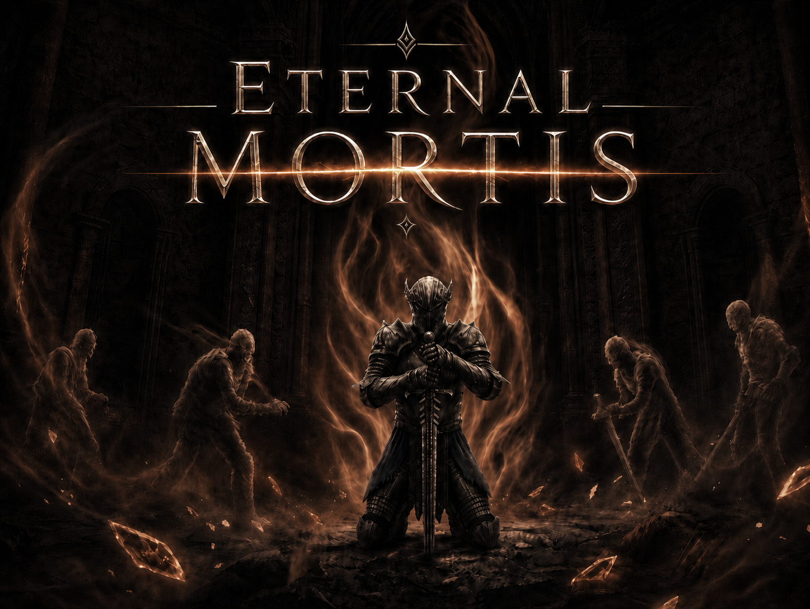
# Eternal Mortis
Eternal Mortis는 Unreal Engine 5로 제작 중인 3D 소울라이크 + 로그라이트 프로젝트입니다.

## 영상

  

    <iframe
      src="https://www.youtube.com/embed/w_k_cKY657M"
      title="Eternal Mortis Gameplay Video"
      allow="accelerometer; autoplay; clipboard-write; encrypted-media; gyroscope; picture-in-picture; web-share"
      allowfullscreen>
    </iframe>
  

  

    <a href="https://www.youtube.com/" target="_blank" rel="noopener noreferrer">YouTube에서 보기</a>
  

## 프로젝트 개요

전투는 소울라이크, 진행은 로그라이트의 형식을 하고 있는 게임입니다.
- 장르: 3D 소울라이크 + 로그라이트
- 엔진: Unreal Engine 5
- 개발 방식: C++ / Blueprint 혼합
- 사용된 플러그인:
    - Gameplay Ability System
    - Niagara
    - Motion Warping

## 다운로드

  

    <strong>itch.io</strong>
    
itch.io에서 배포 예정입니다.

  

  <button class="action-link action-link-disabled" type="button" disabled>Coming Soon</button>

## 팀 소개

  

    

    

      <strong>박시윤</strong>
      Product Manager
      
플레이어 개발

      <a href="https://github.com/tldbs0420" target="_blank" rel="noopener noreferrer">GitHub</a>
    

  

  

    
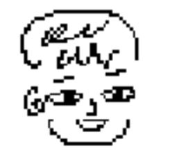

    

      <strong>정찬하</strong>
      Client Programmer
      
적과 보스 AI 개발

      <a href="https://github.com/jch618" target="_blank" rel="noopener noreferrer">GitHub</a>
    

  

  

    

    

      <strong>김효준</strong>
      Level Designer
      
맵 생성 시스템 개발

      <a href="https://github.com/myojun08" target="_blank" rel="noopener noreferrer">GitHub</a>
    

  

  

    

    

      <strong>손강민</strong>
      UI / Art
      
UI, HUD 개발

      <a href="https://github.com/Rkda8071" target="_blank" rel="noopener noreferrer">GitHub</a>
    

  

## 개발 환경

- Unreal Engine 5.6.1
- Visual Studio 2022
- Windows 10 이상

## 기술스택

  

   

## 게임 흐름

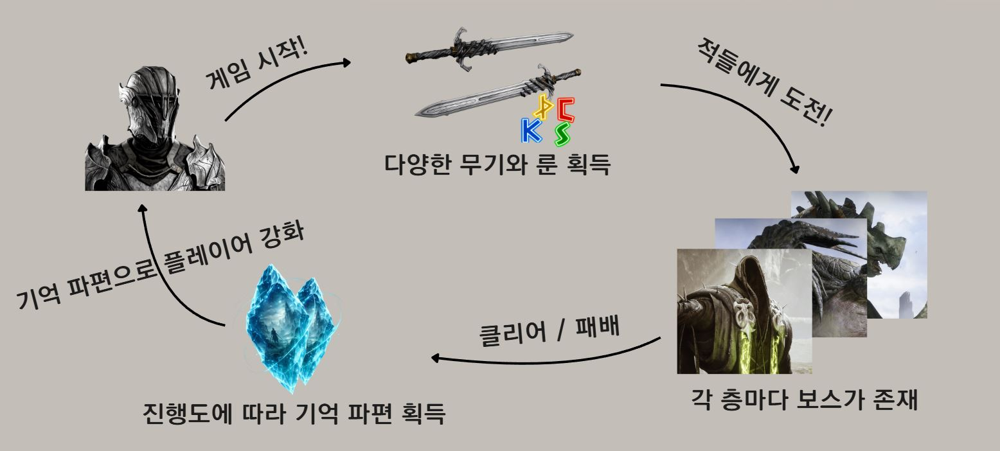
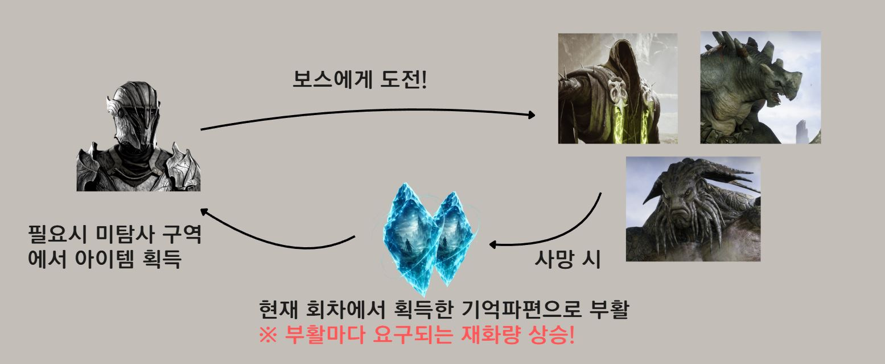

플레이어는 스테이지를 탐색하면서 성장하고 보스에게 도전합니다.

기본적인 흐름은 다음과 같습니다.

1. 스테이지 탐색
2. 적과 전투
3. 상자, 상점 등을 통해 무기와 룬 획득
4. 획득한 장비와 룬을 장착하여 캐릭터 강화
5. 스테이지를 돌파해 보스 전투 진입
6. 진행 중 획득한 기억 파편으로 런 외 추가 성장

## 핵심 기술

### Gameplay Ability System
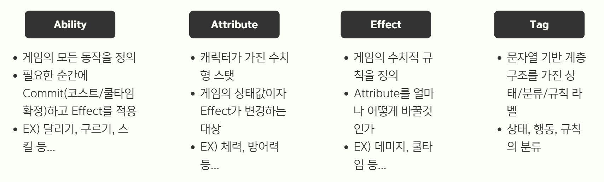

전투 시스템은 Unreal Engine의 Gameplay Ability System을 기반으로 구현했습니다.

공격, 회피, 전회, 피해 처리, 회복, 버프와 디버프 등 전투와 관련된 기능을 Ability와 Gameplay Effect로 분리하여 관리하고 있습니다.

- Gameplay Ability 기반 행동 처리
- Gameplay Effect 기반 피해 / 회복 / 버프 / 디버프 처리
- AttributeSet을 통한 체력, 스태미나, 마나 관리
- Execution Calculation을 이용한 피해 계산식과 같은 복잡한 계산
- SetByCaller를 이용한 상황별 수치 전달

### Motion Warping
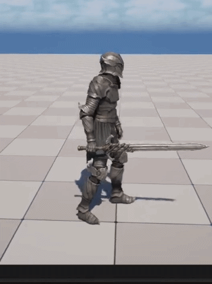

  Motion Warping을 이용해 공격 중 캐릭터 방향을 보정하는 예시

공격, 회피, 상호작용 등 애니메이션이 실행될 때 캐릭터의 위치와 방향을 자연스럽게 보정하기 위해 Motion Warping을 사용했습니다.

이를 통해 타겟이나 상호작용 대상에 맞춰 캐릭터가 어색하지 않게 이동하거나 회전하도록 처리하고 있습니다.

- 공격 중 위치 보정
- 타겟 방향 보정
- 상호작용 애니메이션 위치 보정
- Root Motion 기반 움직임 보정

## AI 활용
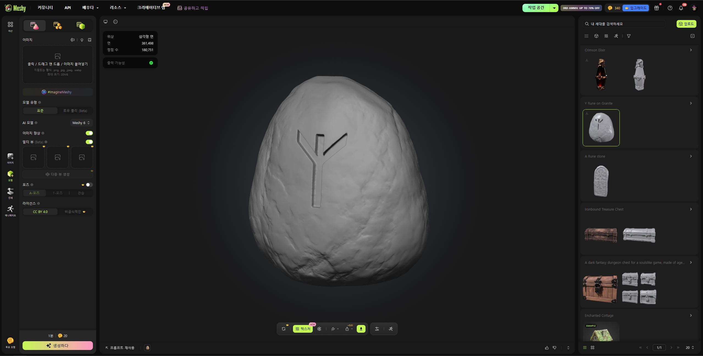

  룬 아이템을 만든 예시  
  https://www.meshy.ai/ko/discover

팀 내에 전담 모델러가 없었기 때문에, 필요한 일부 3D 모델은 Meshy.ai를 활용하여 제작했습니다.
생성된 모델은 그대로 사용하는 것이 아니라 프로젝트 분위기에 맞게 크기, 재질, 충돌 설정 등을 조정한 뒤 Unreal Engine에 적용했습니다.
이를 통해 모델링 리소스가 부족한 상황에서도 필요한 오브젝트를 빠르게 확보하고, 게임 내에서 테스트할 수 있었습니다.

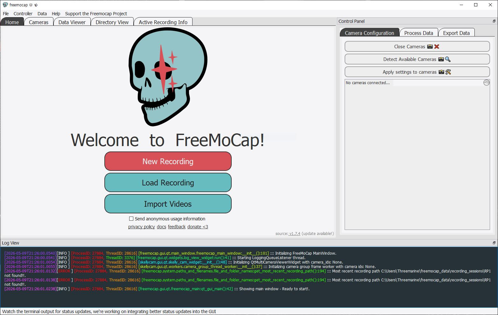

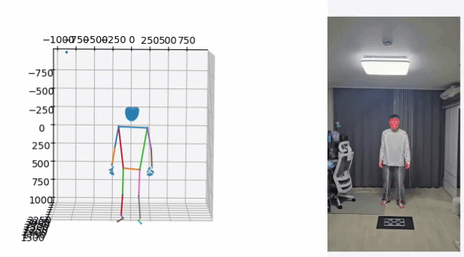
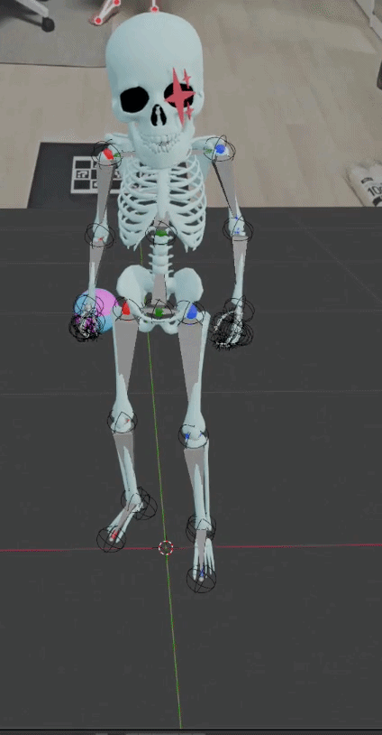
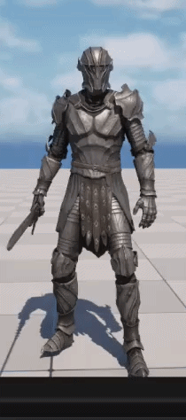

  포션 부족 모션을 만든 예시  
  https://github.com/freemocap/freemocap

또한 애니메이션 에셋이 부족한 문제를 보완하기 위해 FreeMoCap을 활용했습니다.
FreeMoCap을 통해 직접 모션 데이터를 촬영하고, 필요한 동작을 캐릭터에 맞게 보정하거나 리타겟팅하여 프로젝트에 적용했습니다.
이를 통해 무료 애니메이션 에셋만으로 해결하기 어려운 동작을 직접 제작하고 테스트할 수 있었습니다.

이처럼 AI 및 오픈소스 기반 도구를 활용하여 부족한 아트 리소스를 보완하고, 프로토타입 제작과 시스템 테스트 속도를 높일 수 있었습니다.

## 게임 요소

### 전투 시스템

전투는 Gameplay Ability System(GAS)을 기반으로 구현하고 있습니다.

공격, 회피, 전회, 피해 처리, 회복 등의 모든 행동은 Ability와 Gameplay Effect를 통해 처리합니다.

체력, 스태미나, 마나 같은 기본 자원도 Attribute로 관리합니다.

전투 피해량은 무기 공격력, 캐릭터 스탯, 무기 보정, 몬스터의 피해 타입별 저항을 기반으로 계산합니다.

- ### 기본 공격력

> 기본 공격력 = 무기 공격력 * (1 + (((K × 근력) / (K + 근력)) × 근력 보정 + ((K × 기량) / (K + 기량)) * 기량 보정 + ((K × 지혜) / (K + 지혜)) * 지혜 보정) / P)

`K`는 스탯 성장 곡선을 조절하는 값이며, `P`는 전체 공격력 증가량을 조절하는 값입니다.
무기 공격력과 각 보정치는 무기에 할당된 값이며 나머지 스탯은 플레이어에게 달려있습니다.

- ### 일반 공격 피해량

> 최종 피해량 = 기본 공격력 × (1 - 저항치) * 모션 배율

저항치는 공격 타입에 따라 관통 저항, 타격 저항, 참격 저항, 마법 저항 중 하나를 사용합니다.
모션 배율은 각 동작에 할당된 공격력 배율입니다. 예를 들어 동작이 약한 모션은 배율이 낮습니다.

위 수식을 기반으로 엑셀을 활용한 계산을 통해 무기 공격력과 적의 체력들을 설정했습니다.

- 기본 공격
- 회피
- 전회
- 락온
- 피해 및 회복 처리
- 스태미나 / 마나 관리

### 성장 요소
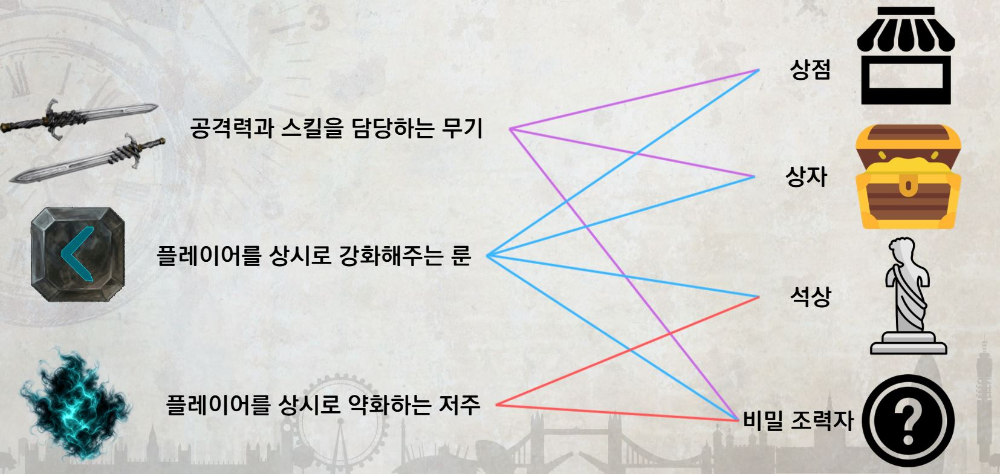
- ### 무기

무기는 전투 스타일을 결정하는 주요 요소입니다.

무기마다 공격 방식, 데미지, 이펙트 등을 다르게 설정할 수 있도록 구성하고 있습니다.

무기는 상자, 상점 등을 통해 획득하는 구조를 기준으로 제작하고 있습니다.

- 무기 장착 및 교체
- 16종의 다양한 무기
- 무기마다 스탯과 모션 설정
- 무기 Trail 이펙트

- ### 룬

룬은 캐릭터의 능력치와 전투 방식을 바꾸는 장착 아이템입니다.

플레이어는 획득한 룬을 장착하여 스탯을 강화하거나 특수 효과를 얻을 수 있습니다.

같은 세트의 룬을 일정 개수 이상 장착하면 세트 효과가 발동합니다.

- 룬 획득
- 룬 장착 및 해제
- 룬 등급
- 룬 개별 효과
- 룬 세트 효과

- ### 룬 세트 효과

참격의 룬

- 2 세트 : 참격피해량 증가 
- 4 세트 : 회피 후 3초 동안 유지되는 '고양감' 획득 
- 6 세트 : 고양감 효과를 5 회 발동시 5 초동안 유지되는 '전투의 흐름' 효과 획득 
고양감 : 3초 이내에 공격 적중 시 추가피해를 주고 스테미너 회복 
전투의 흐름 : 적에게 주는 피해가 증가하고 스테미너 소모량이 감소한다 

관통의 룬

- 2 세트: 관통피해량 증가 
- 4 세트: 공격 적중 시 5초간 유지되는 '가벼운 발걸음' 효과 획득(최대 3중첩) 
- 6 세트: 공격 적중 시 적에게 10초간 유지되는 '잔상' 효과 부여 
- 가벼운 발걸음 : 공격속도, 이동속도 증가 
- 잔상 : 매 초마다 기량에 비례한 데미지를 받음 

연격의 룬

- 2 세트: 적에게 피해를 줄 때마다 최대체력의 1% 만큼 회복 
- 4 세트: 적에게 피해를 5회 줄때마다 스테미나 회복 

신비의 룬

- 2 세트: 마법피해량 증가 
- 4 세트: 전회에 사용되는 마나 감소 및 기술 시전시간 감소 
- 6 세트: 적에게 마법 피해를 줄 때마다 적의 마법저항력 감소 

영감의 룬

- 2 세트: 무기 일반공격이 지혜에 비례한 마법피해를 추가로 입힘 
- 4 세트: 마법 피해를 줄 때마다 마나 회복 

타격의 룬

- 2 세트: 타격피해량 증가 
- 4 세트: 5초마다 다음 공격이 추가 데미지를 입히는 '묵직한 한방' 효과 획득 
- 6 세트: '묵직한 한방' 효과가 강화되어 더 큰 추가피해를 입히고 대상에게 '분쇄' 를 남김 
- 분쇄 : 5회 중첩시 다음 피격에 타격 내성이 취약으로 변경되며 추가피해를 입음 

질량의 룬

- 2 세트: 최대 스테미나 증가 
- 4 세트: 공격시 스테미나 소모량이 증가하지만 증가된 피해를 입힘 

철벽의 룬

- 2 세트: 받는 피해가 감소하지만, 적에게 주는 피해도 감소한다 
- 4 세트: 적에게 피해를 주면 최대체력의 5%를 회복한다 (재사용 대기시간 3초) 
- 6 세트: 적에게 주는 피해가 감소하지만 피해를 입힐 때 적 최대체력의 3%에 해당하는 고정피해를 추가로 입힌다. 

가시의 룬

- 2 세트: 회피에 사용되는 스테미너가 감소한다 
- 4 세트: 회피 시 적에게 피해를 줄 수 있다 

분노의 룬

- 2 세트: 체력을 최대체력의 75% 이상으로 회복할 수 없지만 받는 피해가 감소하고 적에게 주는 피해가 증가한다 
- 4 세트: 적에게 준 피해량의 10%만큼 체력을 회복한다 
- 6 세트: 체력이 25% 이하일 때 스테미너 소모량이 감소하고 적에게 주는 피해량이 증가하며 공격속도가 증가한다 

인내의 룬

- 2 세트: 체력이 낮을수록 받는 피해량이 감소한다 
- 4 세트: 체력이 낮을수록 회복량이 상승한다 

흐름의 룬

- 2 세트: 기술의 마나, 스테미너 소모량이 감소한다. 
- 4 세트: 물리 피해와 마법 피해를 번갈아 가며 입힐 경우 적에게 주는 피해가 증가한다 (최대 5중첩, 5초 유지) 
- 6 세트: 순환 효과가 최대 중첩일때 얻을 수 있다. 다음 전회의 시전속도, 피해량이 증가하고 마나 소모량이 줄어든다. 

순환의 룬

- 2세트: 기술 종료 후 3초 내에 물리공격이 적중하면 정신력을 회복한다 
- 4세트: 기술의 시전 속도가 빨라지며 기술 적중 시 스테미나를 회복한다 

육체의 룬

- 2세트: 최대 체력이 증가한다. 
- 4세트: 최대 스테미나가 증가한다. 

- ### 저주

저주는 런 진행 중 플레이어에게 부여되는 위험 요소입니다.

플레이어는 특정 상황에서 저주를 얻게 되며, 저주는 전투나 탐색에 불리한 효과를 부여합니다.

일정 개수의 저주를 얻으면 엔딩이 바뀔지도 모릅니다…!

- 저주 획득
- 저주 효과 적용
- 저주 수치 관리
- 저주와 룬 효과 연동
- 저주 상태에 따른 전투 변화

### 적

플레이어를 감지하고 추적하며, 거리와 상태에 따라 공격을 수행하도록 제작하고 있습니다.

전투 시스템은 플레이어와 동일하게 Attribute와 Gameplay Effect를 활용하여 피해 처리, 체력 관리, 상태 변화를 처리합니다.

- 플레이어 감지
- 추적 및 공격
- 체력 및 피해 처리
- 피격 반응
- 사망 처리
- 드랍 보상 연동

### 맵 생성
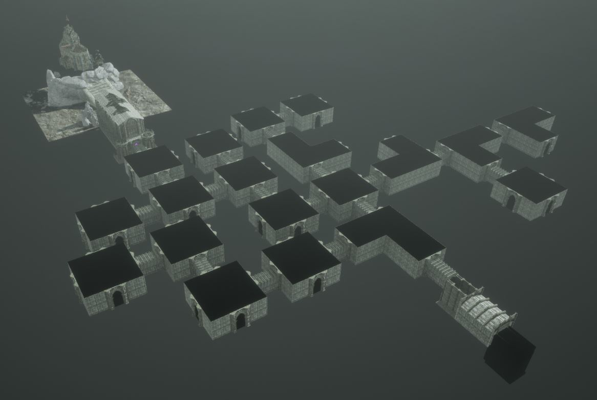
맵은 로그라이트 구조에 맞게 여러 개의 방을 연결하는 방식으로 구성하고 있습니다.

각 방은 전투, 보상, 상점, 이벤트, 보스 등 역할을 가질 수 있으며, 플레이어는 생성된 방을 탐색하며 전투와 성장을 반복합니다.

맵 생성은 정해진 규칙 안에서 랜덤성을 가지도록 절차적 생성을 통해 제작하여, 매 런마다 다른 진행 흐름을 만들 수 있도록 구성하고 있습니다.

- 방 단위 맵 구성
- 전투 방, 보상 방, 상점 방, 보스 방 구분
- 방 연결 구조 생성
- 진행 단계에 따른 방 배치
- 보스 방 진입 구조
- 런마다 다른 맵 흐름 제공

### UI

UI는 플레이어의 상태와 장비 정보를 확인하고, 룬과 성장 요소를 관리하기 위해 제작하고 있습니다.

전투 중에는 체력, 스태미나, 마나 등의 상태를 표시하고, 인벤토리와 룬 장착 화면을 통해 획득한 장비를 관리할 수 있도록 구성하고 있습니다.

그 외에 메인화면 등 전체적인 UI가 잘 동작하도록 설계했습니다.

- 체력 / 스태미나 / 마나 표시
- 락온 대상 표시
- 획득 알림
- HUD 내 세트효과 UI
- 포션 UI
- 플레이어 스탯 UI
- 룬 장착 UI
- 저주 UI
- 기억 파편 성장 UI

--- 

